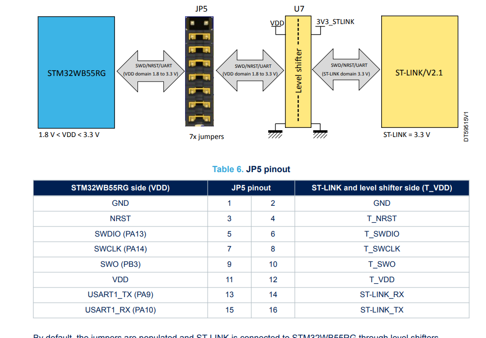

# EITP40_Project_Ali_Yingshuo
EITP40 Final Project

This project presents a decentralized edge AI system for binary classification implemented on the STM32.

With the goal of performing predictive maintenance for brushless DC motors, we develop and evaluate **on-device training** directly on the microcontroller, where **model weights are stored and updated on-device**. We conduct a systematic comparison between classical backpropagation and the Forward-Forward algorithm proposed by Geoffrey Hinton, analyzing their performance and efficiency.

Furthermore, we enable Bluetooth-based **federated learning**, allowing two devices to collaboratively improve a shared global model by exchanging model parameters rather than raw data.

This work can demonstrate the feasibility of adaptive, privacy-preserving, and fully distributed learning on embedded systems, advancing the development of next-generation intelligent edge devices. 

# Repository Structure of the Main Files
```
|
|   README.md <---------------------- **YOU ARE HERE**
|
+---Data  <-------------------------- The dataset [Data in Brief](https://www.sciencedirect.com/science/article/pii/S2352340923006698?via%3Dihub)
|   +---Bearing
|   +---Healthy
|   \---Propeller
|
+---pc <----------------------------- Python code, used in pc
|       Process Results.ipynb <------ Plot Train/Validation process
|       Result_BP.txt <-------------- Store the log file, which should be copied from the output of Send_Data_BP.ipynb
|       Result_FF.txt <-------------- Same
|       Send_Data_BP.ipynb <--------- Sending data from pc, which is used to communicate with STM32
|       Send_Data_FF.ipynb <--------- Same
|       Send_Data_Python.ipynb <----- Python Simulation, which mimics the same process of STM32
|
\---project_WB55
    |   project_WB55.ioc <----------- UI interface, where you can change the connectivity, GPIO, baud rate, etc.
    |   STM32WB55RGVX_FLASH.ld <----- Used to pre-allocate flash to store data permanently
    |   STM32WB55RGVX_RAM.ld
    |
    \---Core
        +---Inc
        |       config.h <----------- IMPORTANT, here you can select the model, change the parameter, and choose the function.
        |       main.h
        |       nn.h 
        |       nn_ff.h
        |       protocol_uart.h
        |       save.h
        |       weights_flash.h
        |
        \---Src
                main.c
                nn.c <--------------- BP Model
                nn_ff.c <------------ FF Model
                protocol_uart.c <---- UART Protocol
                save.c <------------- Move the input
                weights_flash.c <---- Store/load the weights to flash
```

# How to use the current code
1. Please check the [user manual](https://www.st.com/resource/en/user_manual/um2819-stm32wb-nucleo64-board-mb1355-stmicroelectronics.pdf) of NUCLEO-WB55RG

physically remove the jump wires [13,14] [15,16]



Connect the ST-link (pin 14, 16) to LPUART (pin A0, A1) as: 14 - A1, 16 - A0

2. Deploy the STM32 code to the board using STM32IDE
  
3. Run the Python code (Send_Data_BP.ipynb and Send_Data_FF.ipynb), which should match the corresponding model.

# Indication
LED1 (BLUE) toggle = DATA is being received

SW1 press = shut down the Python process

Please note that once you press SW1, the Python will be terminated, and you should manually run it again.
